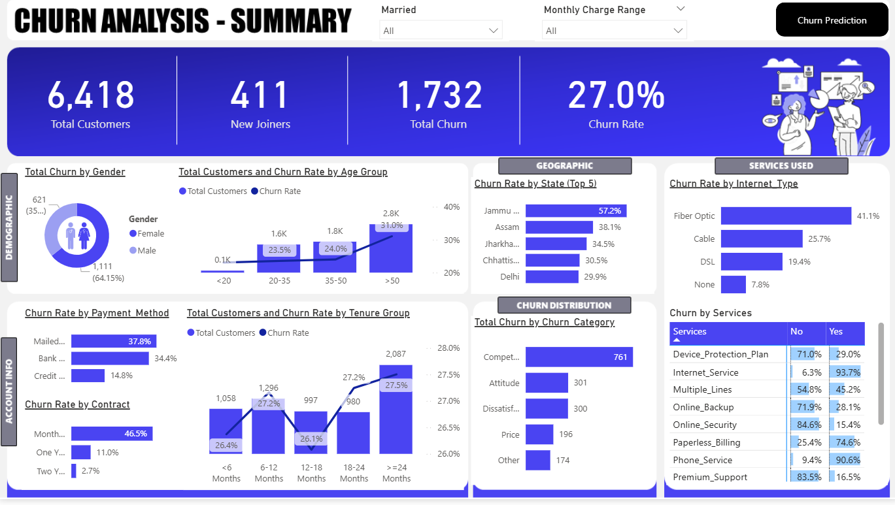
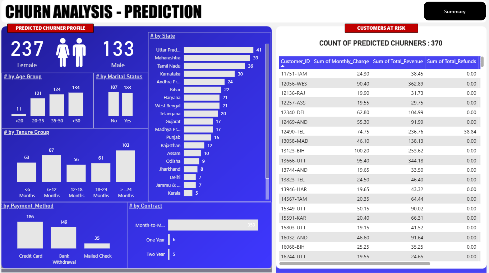
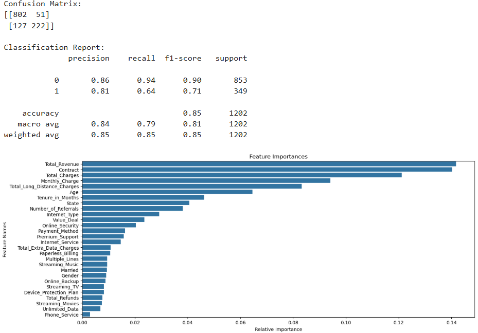

# 📊 Telecom Customer Churn Analysis

> An end-to-end data analytics project — from raw data ingestion to a predictive machine learning model — built to help a telecom business understand, visualise, and predict customer churn.

---

## 🔍 Problem Statement

A telecom company is losing customers at a **27% churn rate**. The business needs to:
1. Understand **who** is churning and **why**
2. Identify the highest-risk customer segments
3. **Predict** which new customers are likely to churn next

---

## 🛠️ Tech Stack

| Layer | Tools Used |
|---|---|
| Database & ETL | Microsoft SQL Server, SSMS |
| Data Transformation | Power Query (Power BI) |
| Visualization | Power BI |
| Machine Learning | Python — Pandas, Scikit-learn, Random Forest |
| Notebook | Jupyter Notebook |

---

## 📌 Project Workflow

### Step 1 — ETL in SQL Server
- Ingested raw telecom CSV data into a staging table via SSMS Import Wizard
- Explored distributions across gender, contract type, customer status, and state
- Performed null checks across all 32 columns
- Cleaned nulls using `ISNULL()` and loaded production-ready data into `prod_Churn`
- Created two views for downstream use:
  - `vw_ChurnData` — historical churned/stayed customers
  - `vw_JoinData` — newly joined customers for prediction

### Step 2 — Power BI Transformation
- Connected Power BI directly to SQL Server views
- Added calculated columns: Churn Status (binary flag), Monthly Charge Range
- Built mapping tables for Age Group and Tenure Group with custom sort ordering
- Unpivoted 8 service columns into a normalised `prod_Services` table

### Step 3 — DAX Measures
```
Total Customers = COUNT(prod_Churn[Customer_ID])
Total Churn = SUM(prod_Churn[Churn Status])
Churn Rate = [Total Churn] / [Total Customers]
New Joiners = CALCULATE(COUNT(...), Customer_Status = "Joined")
```

### Step 4 — Power BI Dashboard
Two interactive dashboard pages built in Power BI:

**Summary Page** — Historical churn analysis
- KPI cards: 6,418 Total Customers · 411 New Joiners · 1,732 Total Churn · 27% Churn Rate
- Demographic breakdown: Gender and Age Group vs Churn Rate
- Account info: Payment Method, Contract Type, Tenure Group
- Geographic: Top 5 States by Churn Rate
- Churn distribution: Churn Category with drill-through Churn Reason tooltip

**Churn Prediction Page** — Predicted future churners
- Demographic, account, and geographic breakdown of predicted churners
- Customer-level grid: Monthly Charge, Total Revenue, Refunds, Referrals

### Step 5 — Churn Prediction (Random Forest)
- Exported SQL views to Excel as ML input
- Preprocessed: dropped irrelevant columns, label encoded 19 categorical features
- Trained `RandomForestClassifier` (100 estimators) on historical churn data
- Evaluated with confusion matrix and classification report
- Applied model to `vw_JoinData` to predict future churners
- Exported predictions to CSV and loaded back into Power BI

---

## 📈 Dashboard Preview

### Summary Dashboard


### Churn Prediction Dashboard


---

## 🤖 Model Performance

| Metric | Score |
|---|---|
| Overall Accuracy | **85%** |
| Precision (Churn class) | 0.81 |
| Recall (Churn class) | 0.64 |
| F1-Score (Churn class) | 0.71 |
| Predicted Future Churners | **370 out of 411 new joiners** |

**Top predictive features:** Total Revenue, Contract Type, Total Charges, Monthly Charge, Total Long Distance Charges



---

## 💡 Key Insights

| Finding | Detail |
|---|---|
| Highest churn contract | Month-to-month — **46.5% churn rate** |
| Lowest churn contract | Two-year — **2.7% churn rate** |
| Highest risk internet type | Fiber Optic — **41.1% churn rate** |
| Highest risk state | Jammu — **57.2% churn rate** |
| Top churn reason | Competitor offers — **761 customers** |
| Most at-risk tenure | Customers under 6 months |
| Gender churn split | Female 64.15% · Male 35.85% of churners |

---

## 📁 Repository Structure

```
├── SQL/
│   ├── staging_table.sql
│   ├── null_check.sql
│   ├── prod_churn_insert.sql
│   └── create_views.sql
├── Python/
│   └── churn_prediction.ipynb
├── PowerBI/
│   └── Churn_Analysis.pbix
├── Data/
│   └── telecom_customer_data.csv
├── screenshots/
│   ├── Churn-analysis-summary.png
│   ├── Churn-analysis-prediction.png
│   └── confusion_matrix.png
└── README.md
```

---

## 🚀 How to Run

1. **SQL Setup** — Open SSMS, create database `db_Churn`, run SQL scripts in order
2. **Power BI** — Open `.pbix` file, update SQL Server connection to your server name
3. **Python Model** — Open `churn_prediction.ipynb` in Jupyter, update the file path to `Prediction_Data.xlsx`, run all cells

---

## 📝 Credits

Project built by following the [PivotalStats End-to-End Churn Analysis Tutorial](https://pivotalstats.com/end-end-churn-analysis-portfolio-project/).

---

## 🔗 Connect

[](https://linkedin.com/in/satyam-singroul)
[](https://github.com/SatyamSinghSingroul)
